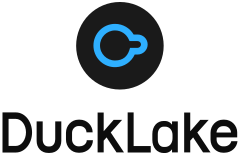
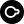

# DuckLake Branding

## Logos

| Logo                                                    | SVG                                                        | PNG                                                        |
| :------------------------------------------------------ | :--------------------------------------------------------- | :--------------------------------------------------------- |
|      | [logo-dark-inline.svg](logos/svg/logo-dark-inline.svg)     | [logo-dark-inline.png](logos/png/logo-dark-inline.png)     |
|    | [logo-dark-stacked.svg](logos/svg/logo-dark-stacked.svg)   | [logo-dark-stacked.png](logos/png/logo-dark-stacked.png)   |
|    | [logo-light-inline.svg](logos/svg/logo-light-inline.svg)   | [logo-light-inline.png](logos/png/logo-light-inline.png)   |
|  | [logo-light-stacked.svg](logos/svg/logo-light-stacked.svg) | [logo-light-stacked.png](logos/png/logo-light-stacked.png) |

## Icons

| Icon                                  | SVG                                      |
| :------------------------------------ | :--------------------------------------- |
|      | [icon-dark.svg](icons/icon-dark.svg)     |
|    | [icon-light.svg](icons/icon-light.svg)   |
|  | [icon-simple.svg](icons/icon-simple.svg) |

## Colors

### Logomark

| Color                                              | Hex       | RGB                 | HSL                   |
| :------------------------------------------------- | :-------- | :------------------ | :-------------------- |
|  | `#2EAFFF` | `rgb(46, 175, 255)` | `hsl(203, 100%, 59%)` |
|  | `#1A1A1A` | `rgb(26, 26, 26)`   | `hsl(0, 0%, 10%)`     |

### Logotype

| Color                                              | Hex       | RGB                  | HSL               |
| :------------------------------------------------- | :-------- | :------------------- | :---------------- |
|  | `#0D0D0D` | `rgb(13, 13, 13)`    | `hsl(0, 0%, 5%)`  |
|  | `#F2F2F2` | `rgb(242, 242, 242)` | `hsl(0, 0%, 95%)` |
