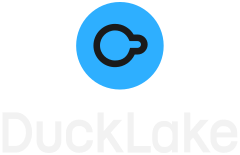

# DuckLake Branding

## Logos

| Logo                                                | File                                                         |
| :-------------------------------------------------- | :----------------------------------------------------------- |
|      | [logos/logo-dark-inline.svg](logos/logo-dark-inline.svg)     |
|    | [logos/logo-dark-stacked.svg](logos/logo-dark-stacked.svg)   |
|    | [logos/logo-light-inline.svg](logos/logo-light-inline.svg)   |
|  | [logos/logo-light-stacked.svg](logos/logo-light-stacked.svg) |

## Icons

| Icon                                  | File                                           |
| :------------------------------------ | :--------------------------------------------- |
|      | [icons/icon-dark.svg](icons/icon-dark.svg)     |
|    | [icons/icon-light.svg](icons/icon-light.svg)   |
|  | [icons/icon-simple.svg](icons/icon-simple.svg) |

## Colors

| Color                                              | Hex       | RGB                  | HSL                   |
| :------------------------------------------------- | :-------- | :------------------- | :-------------------- |
|  | `#2EAFFF` | `rgb(46, 175, 255)`  | `hsl(203, 100%, 59%)` |
|  | `#1A1A1A` | `rgb(26, 26, 26)`    | `hsl(0, 0%, 10%)`     |
|  | `#F2F2F2` | `rgb(242, 242, 242)` | `hsl(0, 0%, 95%)`     |
